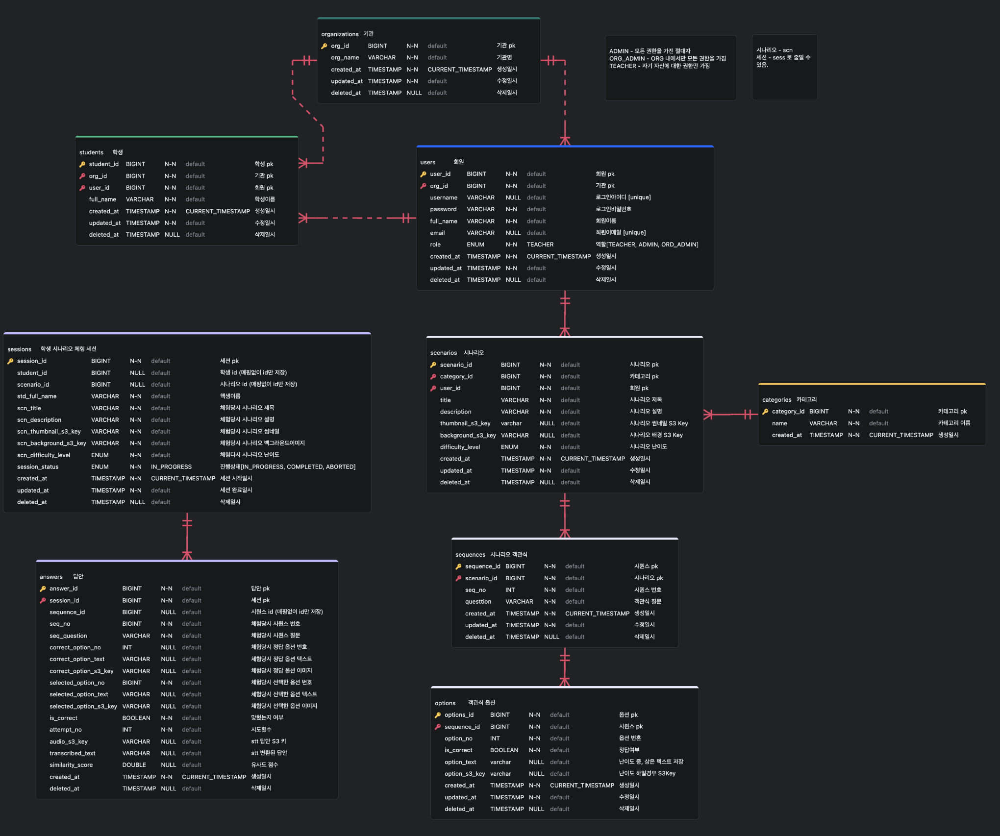

# 마주교실 (Maju Class)

> ### **삼성청년 소프트웨어 AI 아카데미 13기 자율 프로젝트 3등**  

## 📚 프로젝트 소개

발달장애 사회적 상황 시뮬레이션 서비스

## 🎨 미리보기

## 🏗️ ERD

## 📝 서비스 개요
마주교실은 발달장애를 가진 학생들이 일상에서 일어나는 다양한 상황을 안전하게 연습할 수 있는 시뮬레이션 기반 교육 플랫폼입니다. 

### 목표

학생들을 위한 교보재 제작 간편화를 통해 선생님들의 교보재 제작 피로도를 낮추고,  
학생들이 쉽고 재밌게 여러 상황을 학습하게 합니다.

## 🔍 문제 정의

### 1. 교보재 품질의 불균형

- 교육자마다 시나리오 제작에 투입하는 **시간과 역량이 상이**
- 결과적으로 학습자가 받는 **교육 품질이 일관되지 않음**
- 시나리오 제작에 많은 시간이 소요되어 교사의 피로도 증가

### 2. 반복 학습의 한계
- 대면 훈련 중심으로, 학습자가 **원할 때 반복 연습하기 어려움**
- 동일한 시나리오를 **다양한 난이도로 경험할 기회 부족**
- 학습 진도와 성취도를 체계적으로 추적하기 어려움

## 💡 해결 방안

### AI 기반 시나리오 제작 도구
- 교육자가 AI와 협업하여 시나리오를 생성할 수 있는 **일관된 템플릿 제공**
- RAG 기술로 맥락에 맞는 시나리오 자동 생성
- 제작 시간 단축 및 품질 표준화

### 난이도별 시나리오 시스템
- **EASY**(이미지 선택) → **NORMAL**(텍스트 선택) → **HARD**(음성 답변) 단계별 학습
- 학습자가 **언제든지 반복 학습** 가능한 환경 구축
- 학습자가 **언제든지 반복 학습** 가능한 환경 구축
- 음성 인식(STT) 및 의미 유사도 분석(STS)을 통한 실시간 피드백

## ✨ 주요 기능

### 교사 기능
- **학생 관리**: CRUD, CSV 일괄 등록
- **시나리오 생성**: 
  - 수동 생성 (질문/답변/픽토그램)
  - AI 자동 생성 (RAG 기반, 백그라운드 처리)
- **학습 분석**: 통계 대시보드, 월별 캘린더

### 학생 기능  
- **난이도별 시뮬레이션**:
  - EASY: 이미지 선택
  - NORMAL: 텍스트 선택
  - HARD: 음성 답변 (STS 분석)
- **실시간 피드백**: 정답/오답 즉시 확인
- **음성 지원**: TTS 질문 읽기, STS 답변 분석

## 🛠️ 기술 스택

### Frontend
- **Language**: TypeScript
- **Framework**: React, Vite
- **UI/스타일링**: TailwindCSS, React Icons, Lottie React React-chartjs-2
- **상태관리**: Zustand, React Query(TanStack Query)
- **라우팅**: React Router Dom
- **개발 도구**: ESLint
- **유틸리티**: Axios

### Backend
- **Language**: Java 21
- **Framework**: Spring Boot 3.5.6 
- **Database**: MySQL, Redis
- **ORM**: Spring Data JPA
- **인증/보안**: Spring Security, JWT
- **개발도구**: Lombok, SpringDoc OpenAPI, Logback, Gradle

### AI Service
- **Language**: Python 3.11
- **Framework**: FastAPI 0.115.5, Uvicorn 0.32.1 
- **Database**: MySQL, ChromaDB
- **ORM**: SQLAlchemy
- **인증/보안**: python-jose
- **AI 라이브러리**: PyTorch, sentence-transformers, LangChain, OpenAI, NumPy

### Infrastructure
- **컨테이너**: Docker Compose
- **Cloud**: AWS S3, AWS ApiGatewway, AWS Lambda, AWS Athena
- **CI/CD**: GitLab runner
